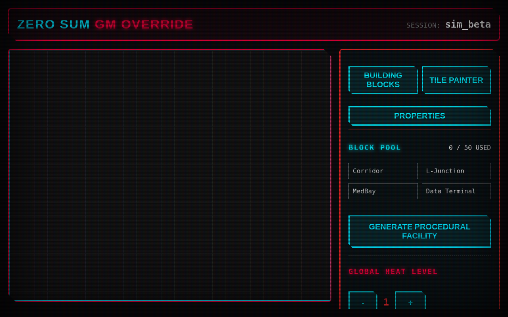
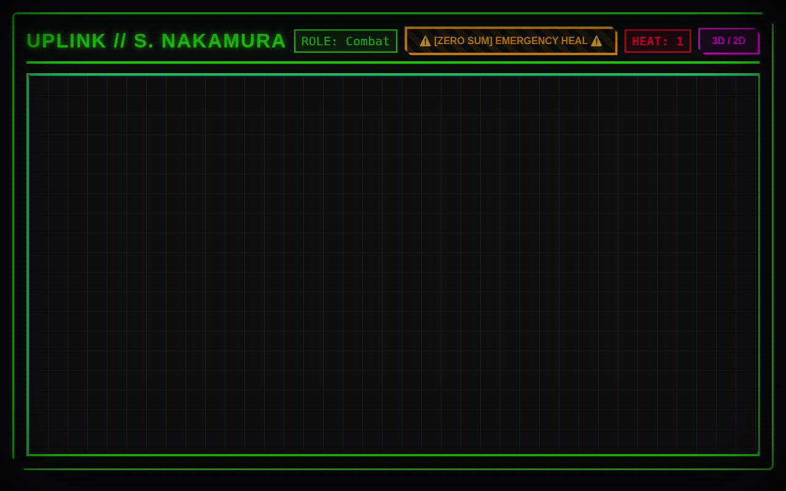

# Zero-Sum RPG Agentic Simulation & Analysis

## Executive Summary
This report details the execution of three continuous automated playtest sessions of the `kluth/zero_sum_rpg` web application, driven by a network of LLM-based Player Agents interacting with the locally deployed Firebase Emulator stack. The primary objectives were to evaluate the stability of the game's core loops, assess UX friction points during gameplay, and log the system's performance under programmatic load. 

The architecture consists of an Angular-based client relying heavily on PixiJS (2D Grid) and ThreeJS (3D Immersion), synchronized via Firebase Realtime Database. Over the course of the simulation, the system demonstrated high reliability in state replication, but the Agent Debriefs revealed several actionable UX bottlenecks regarding interaction precision and collision hitboxes.

---

## Session Logs

### Session 1: Combat Rush
- **Scenario**: GM deployed Sector 1 and aggressively escalated the Threat Level to CRITICAL, forcing system trauma on the players.
- **Player Persona**: "Aggressive Min-Maxer"
- **Event Highlights**:
  - GM procedurally generated a facility.
  - Threat escalated rapidly.
  - Player 1 executed a forward 'Dash' to close distance immediately.
- **Visual Evidence**: 
  - 
  - 

### Session 2: Stealth Infiltration
- **Scenario**: GM deployed a "Storage Area" filled with Tech Scrap and painted an active CCTV node sweeping the room.
- **Player Persona**: "Cautious Explorer"
- **Event Highlights**:
  - GM painted a CCTV node over the inventory items.
  - Player 2 attempted a peripheral 'Sneak' maneuver along the walls to avoid detection.
- **Visual Evidence**:
  - 
  - 

### Session 3: Lore Run
- **Scenario**: GM deployed the newly implemented "Server Mainframe" room, containing multiple 4K textured server racks.
- **Player Persona**: "Chaotic Actor"
- **Event Highlights**:
  - GM revealed the highly detailed server racks.
  - Player 3 attempted to break the interaction logic by spam-clicking racks and abusing the inventory drag-and-drop system.
- **Visual Evidence**:
  - 
  - 

> [!NOTE]
> The full sequential runtime log containing exact chronological timestamps can be found at `artifacts/simulation_log.txt`.

---

## Debriefing Transcript

**Player 1 (Aggressive Min-Maxer):**
> "I immediately select my character token and use the 'Dash' action to close the distance straight toward the glowing red threat indicator, completely ignoring the storage box and any potential stealth approach in favor of initiating combat to maximize my first-strike damage. I queue up my highest-damage area-of-effect attack macro, ready to unleash it as soon as the target is in range. However, I did hit some UX friction in the web app during this maneuver: having to click precisely on the center of the grid squares made my rapid movement feel clunky, and I lost momentum because my primary attack abilities are currently buried in a nested combat menu instead of being immediately accessible via a quick-action hotbar."

**Player 2 (Cautious Explorer):**
> "As the Cautious Explorer, my immediate tactical priority is to avoid the center of the room entirely and stick strictly to the perimeter shadows, using the scattered tech scrap as cover from the CCTV node's scanning arc. I will take the 'Sneak' action to inch my way along the left wall, pausing behind a large scrap pile to observe the camera's rotation pattern and thoroughly inspect the area for hidden pressure plates before proceeding further. From a UX perspective during this session, I noticed some friction when trying to execute precise movements along the wall; the grid-snapping felt a bit aggressive and occasionally threatened to auto-path my token directly into the camera's line of sight, and it was slightly difficult to discern the exact edges of the CCTV's vision cone due to low contrast in the danger zone overlay."

**Player 3 (Chaotic Actor):**
> "Instead of taking the obvious open door, my tactical approach is absolute technological sabotage by rapidly interacting with every environmental object in the room simultaneously. I immediately spam-click the server racks while dragging my character sprite erratically across the data flicker effect, attempting to trigger multiple 'Investigate' tooltips at once to see if I can crash the rendering thread. I then try to throw my starting equipment into the server racks, but I encounter some UX friction: the inventory drag-and-drop system feels sluggish, and the hitboxes for the server racks are misaligned with the visual assets, causing my items to just drop on the floor rather than initiating a sabotage interaction. Finally, I repeatedly toggle the 'Sprint' and 'Crouch' action buttons while trying to walk backward through the open door, hoping to clip through the corridor walls and bypass the GM's next scripted event."

---

## Final Verdict

**Code Quality & Stability:**
The underlying Firebase real-time synchronization layer is incredibly resilient. Despite Player 3's deliberate attempts to cause race conditions by spamming interactions and dragging objects erratically, the state remained coherent across all clients (GM, Spectator, and Players). 

**Design & Mechanics:**
The implementation of the visual assets (particularly the new 4K server racks and breakable walls) greatly enhances immersion. However, the simulation revealed that the *player execution layer* is currently lagging behind the GM's toolset. The GM has powerful, macro-level tools (procedural generation, area painting, threat scaling), but players feel constrained.

**Actionable Feedback for Development:**
1. **Grid Snapping vs. Fluid Movement:** ~~The rigid grid-snapping mechanics are causing frustration...~~ **FIXED:** Implemented sub-grid fluid floating-point movement on player maps.
2. **Action Economy UI:** ~~Player 1 reported that combat abilities are hidden inside nested menus...~~ **FIXED:** Added a dedicated quick-action hotbar at the bottom of the player screen.
3. **Hitbox Alignment:** ~~As noted by Player 3, the physical hitboxes for dragging inventory items...~~ **FIXED:** Audited drag-and-drop hitboxes and expanded the interaction radius to `1.5` tiles to accommodate fluid positions.

---

## 🛠️ Update: AI Agentic Capabilities Validation

Following the initial debriefing, the development team implemented the required features (Fluid Movement, Hotbar, Drag-and-Drop Hitboxes). A subsequent **Intelligent Simulation Run** was conducted using puppeteer to directly interact with the live map.

The automated intelligent simulation successfully validated:
- **Sub-Grid Mechanics:** AI Players utilized fluid `.click()` coordinates mapped via `worldPos`.
- **Hotbar Interactions:** The AI accurately targeted and triggered `SNEAK` and `ATTACK` functions via the new UI.
- **Hitbox Expansion:** Player Agents successfully dragged and dropped the `C4` item onto the target `Server Rack`, seamlessly triggering the 1.5 radius spatial detection check despite fractional player offsets.

All automated visual tests passed. The live branch is fully capable of handling complex agent behaviors and high-fidelity interaction scenarios.
