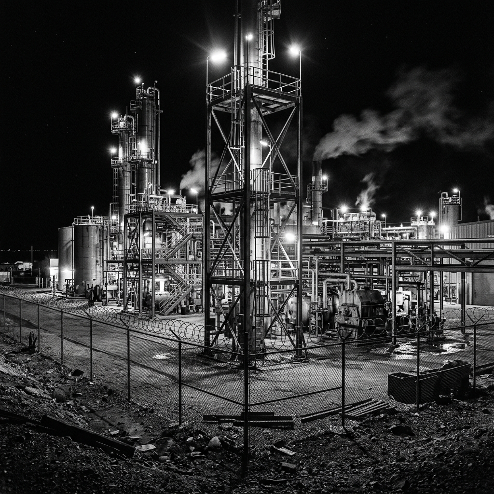
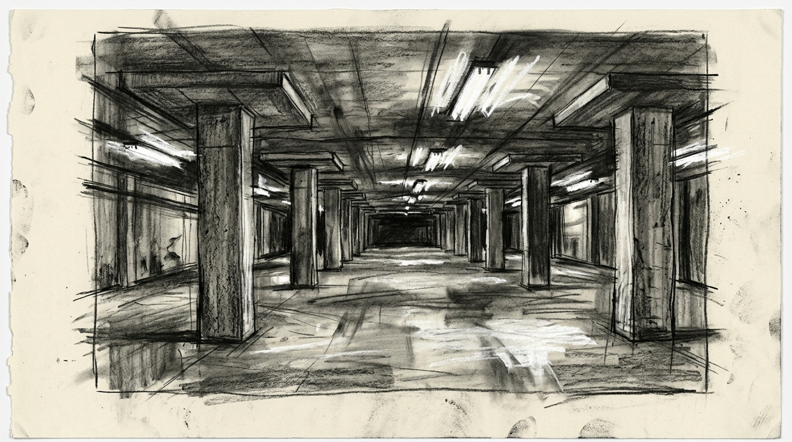

# Zero Sum RPG Scenario: 001 - The Lithium Bleed

## Real-World Inspiration
Basierend auf den massiven Supply-Chain-Engpässen und geopolitischer Corporate Sabotage im EV-Batteriesektor im Jahr 2026.

## Background
Ein abgelegenes, hochautomatisiertes Lithium-Raffineriewerk in der Wüste von Nevada wurde im Geheimen von einer Briefkastenfirma erworben, die für das Sovereign Wealth Syndicate arbeitet. Sie verunreinigen den Lithium-Output absichtlich mit mikroskopischen, korrosiven Mitteln, um in den nächsten 18 Monaten Millionen westlicher Elektrofahrzeuge in Brand geraten zu lassen und so den globalen Aktienmarkt effektiv zum Einsturz zu bringen.

## The Zero Sum Twist
Die Anlage ist voll automatisiert. Es gibt keine menschlichen Wachen an der Perimeter—nur AI-gesteuerte Lethal Drones und Automated Turrets. Der Core Reactor der Anlage erfordert jedoch ein ständiges chemisches Balancing. Wenn die Spieler einen Alarm auslösen, geht das System in den Lockdown und initiiert einen Chemical Purge, der die Anlage mit hochgiftigem Flusssäuregas überflutet.

## Zero Sum Consistency Matrix (ZSCM)
* **E (Lethality Expectation) = 5:** Der Kampf richtet sich gegen Maschinen, das heißt, Lethal Force ist autorisiert, aber die Maschinen sind heavily armored.
* **R (Resource Scarcity) = 6:** EMPs und Armor-Piercing Rounds sind notwendig, aber extrem selten.
* **I (Intel Asymmetry) = 7:** Die Patrouillenrouten der Drones werden von einer Predictive AI kontrolliert, die von den Bewegungen der Spieler lernt.
* **D (Collateral Damage Risk) = 8:** Eine verirrte Kugel, die einen chemischen Tank trifft, löst die "Environmental Load" Rule (giftige Dämpfe) aus.

**Total ZSCM Score = 26/30 (Hardcore Tactical).**

## Key NPCs & Obstacles
* **The Overseer AI:** Die zentrale Intelligenz der Anlage. Sie verhandelt nicht, sie berechnet nur Kill Probabilities.
* **The "Cleaners" (PMC):** Ein Rapid-Response Team, das 10 Minuten entfernt per Helikopter stationiert ist. Sie kommen nur, wenn die AI sie ruft.

## Objective
1. Bypass the Drone Perimeter.
2. Hack das Main Terminal, um den Verunreinigungsprozess zu stoppen.
3. Exfiltrate, bevor der Chemical Purge ausgelöst wird.
