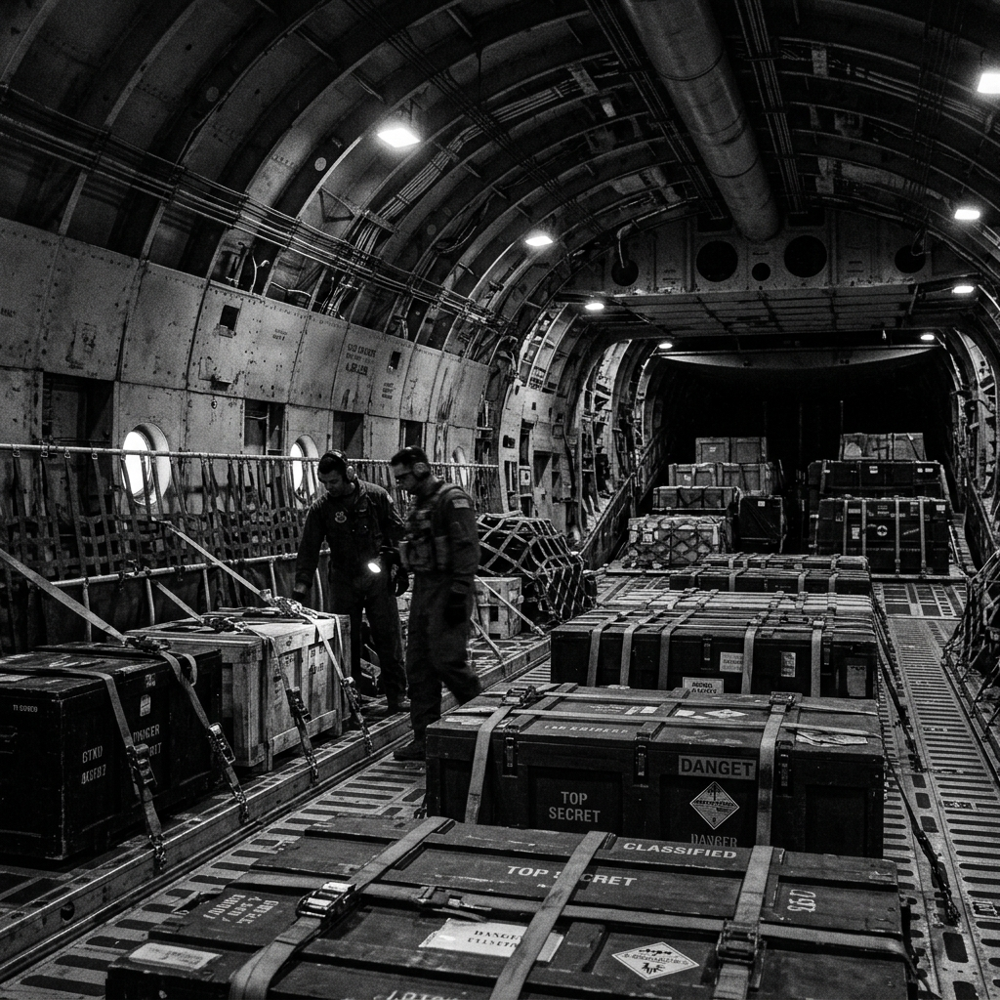

# Zero Sum RPG Scenario: 002 - Ghost Flight 88

## Real-World Inspiration
Gebaseerd op de opkomst van autonome drone-cargo vluchten en GPS-spoofing incidenten in de commerciële luchtvaart.

## Background
Een volledig autonoom heavy-lift cargo vliegtuig (Flight 88), dat een geclassificeerd quantum-decryption prototype vervoert, steekt de Stille Oceaan over. Een rogue state actor heeft met succes het vliegtuig ge-GPS-spoofed, waardoor het van koers is veranderd richting een black-site airstrip. De players moeten het vliegtuig halverwege de vlucht enteren vanuit een stealth transport, de handmatige controle terugkrijgen en het prototype per parachute boven internationale wateren droppen, voordat de rogue state het onderschept.

## The Zero Sum Twist
Er zijn geen menselijke piloten. De cockpit is verzegeld en gevuld met stikstof om brand te voorkomen. Bovendien is de cargo hold van het vliegtuig volgepakt met hoog-explosieve munitie. Een enkel schot of een verdwaalde vonk in de cargo bay zal het hele vliegtuig vernietigen. De players moeten de stowaway hijackers van de rogue state in absolute stilte uitschakelen, waarbij ze uitsluitend non-lethal of kinetic melee weapons gebruiken.

## Zero Sum Consistency Matrix (ZSCM)
* **E (Lethality Expectation) = 8:** Als er een vuurwapen wordt afgevuurd, sterft iedereen. De hijackers weten dit, wat een brute hand-to-hand omgeving creëert.
* **R (Resource Scarcity) = 9:** Je bent 30.000 voet in de lucht. Er is geen backup, geen exfil en geen extra gear.
* **I (Intel Asymmetry) = 5:** De players hebben de schematics van het vliegtuig, maar de hijackers hebben root access tot de interne sensoren van het vliegtuig.
* **D (Collateral Damage Risk) = 6:** Een crash boven de oceaan minimaliseert burgerslachtoffers, maar garandeert totale mission failure.

**Total ZSCM Score = 28/30 (Extremely Lethal).**

## Key NPCs & Obstacles
* **The "Spetsnaz" Stowaways:** Hooggetrainde, uiterst stille hand-to-hand combatants die wachten in het donkere cargo hold.
* **The Nitrogen Cockpit:** Inbreken in de cockpit betekent omgaan met een zuurstofarme omgeving. De players hebben 60 seconden adembare lucht tenzij ze lokale oxygen supplies meebrengen.

## Objective
1. Enter het vliegtuig tijdens de vlucht (vereist hoge Kinetics/Piloting checks).
2. Neutraliseer de hijackers zonder firearms te gebruiken.
3. Krijg toegang tot de met stikstof gevulde cockpit om de autopilot te overriden.
4. Drop de payload en maak een HALO jump voordat het vliegtuig hostile airspace binnengaat.
