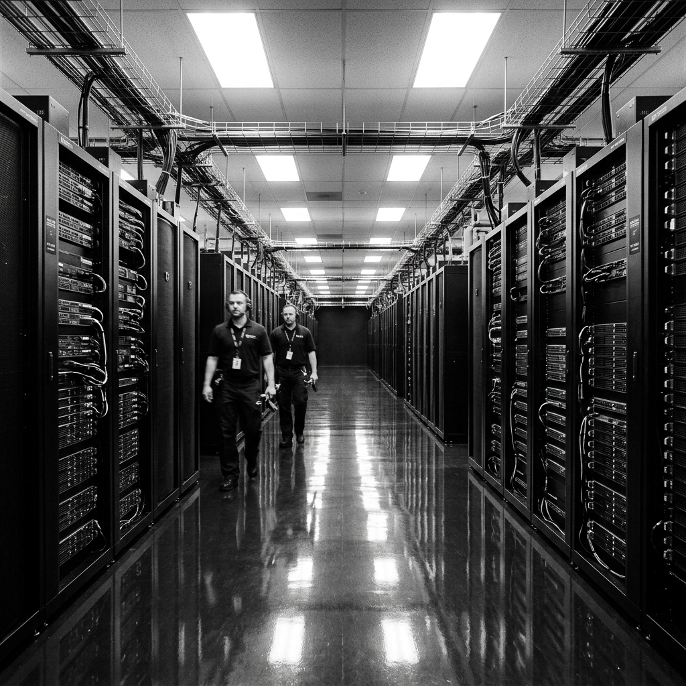

# Zero Sum RPG Scenario: 003 - The Silent Algorithm

## Real-World Inspiration
Basierend auf der hochgeheimen Welt des High Frequency Trading (HFT) und dem Risiko von algorithmischen "Flash Crashes", die von feindlichen staatlichen Akteuren inszeniert werden.

## Background
Ein abtrünniger quantitativer Hedgefonds hat einen illegalen, hochaggressiven KI-Trading-Algorithmus auf einem Direct-Access-Server eingesetzt, der sich physisch im Rechenzentrum der Frankfurter Wertpapierbörse befindet. Der Algorithmus ist darauf ausgelegt, einen kaskadierenden Short-Sell-Angriff auszuführen, der den europäischen Energiemarkt innerhalb von 48 Stunden künstlich zum Absturz bringt und das Syndikat um Milliarden bereichert.

## The Zero Sum Twist
Der Serverraum ist eine sterile, hypersichere Umgebung. Er nutzt ein akustisches Erkennungssystem. Jedes Geräusch über 45 Dezibel (ein lautes Flüstern, ein fallengelassenes Werkzeug oder schwere Schritte) löst den stillen Alarm aus, verriegelt die Tresortüren und entsendet bewaffnete taktische Eingreiftrupps mit Gasmasken. Die Players müssen das Rechenzentrum infiltrieren, das spezifische Server-Blade aus Tausenden von identischen finden und physisch eine Logikbombe installieren, ohne einen Ton von sich zu geben.

## Zero Sum Consistency Matrix (ZSCM)
* **E (Lethality Expectation) = 7:** Wenn der akustische Alarm ausgelöst wird, wendet das Response-Team tödliche Gewalt und Tränengas an.
* **R (Resource Scarcity) = 8:** Players können aufgrund der akustischen Sensoren keine Standard-Einbruchswerkzeuge, Sprengstoffe oder Schusswaffen verwenden.
* **I (Intel Asymmetry) = 5:** Das Finden des richtigen Server-Blades erfordert spontane Tech checks auf hohem Niveau.
* **D (Collateral Damage Risk) = 5:** Die Anlage ist nachts größtenteils frei von Zivilisten, aber die Zerstörung des falschen Servers könnte unschuldige Pensionsfonds zum Absturz bringen.

**Total ZSCM Score = 25/30 (High Tension Stealth).**

## Key NPCs & Obstacles
* **The Acoustic Grid:** Eine allgegenwärtige Umweltbedrohung. Die Bewegungsgeschwindigkeit wird halbiert.
* **The SysAdmin:** Ein einzelner, überarbeiteter IT-Techniker, der die Nachtschicht arbeitet und jederzeit in den Gang wandern könnte.

## Objective
1. Umgehe die biometrische Sicherheit am Eingang des Rechenzentrums.
2. Navigiere in absoluter Stille durch die Servergänge.
3. Identifiziere das abtrünnige HFT-Blade.
4. Lade den Counter-Virus hoch und extrahiere, bevor die Frühschicht eintrifft.
