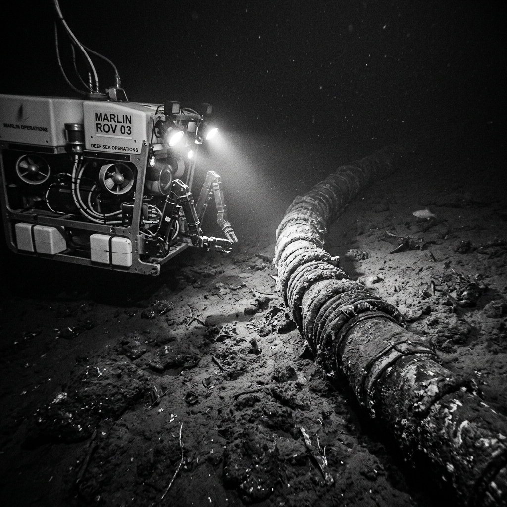
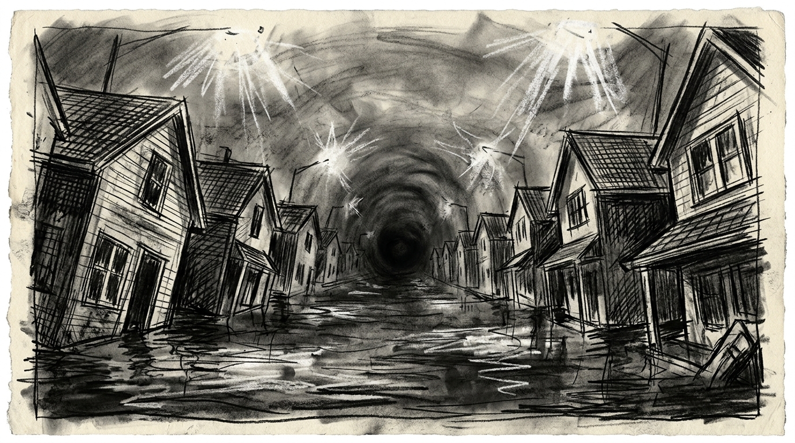

# Zero Sum RPG Scenario: 004 - Subnautica Taps

## Real-World Inspiration
Inspiriert von geopolitischen Bedenken bezüglich der Verwundbarkeit von transatlantischen Tiefsee-Glasfaserkabeln gegenüber Sabotage durch autonome militärische U-Boote.

## Background
Eine unmarkierte, autonome Submersible Drone hat sich in 2.000 Metern Tiefe im Atlantischen Ozean an das transatlantische MAREA-Kabel geklemmt. Sie injiziert langsam korrumpierte Packets in das globale Banken-SWIFT-System. Die Spieler wurden von einem Konsortium von Banken angeheuert, um die Kontrolle über ein experimentelles Tiefsee-ROV (Remotely Operated Vehicle) von einem Forschungsschiff an der Oberfläche aus zu übernehmen, hinunter zum Kabel zu navigieren und die Rogue Drone physisch abzukoppeln.

## The Zero Sum Twist
Die Spieler sind nicht in physischer Gefahr durch Kugeln—sie sind sicher im Control Room des Surface Vessels. Allerdings nähert sich eine Mercenary Frigate ihren Koordinaten an der Oberfläche. Sie haben genau 40 Minuten, um die heikle Underwater ROV Operation abzuschließen, die Drone wegen ihrer verschlüsselten Hard Drive hochzuziehen und zu fliehen, bevor die Mercenaries ihr Schiff entern und sie exekutieren.

## Zero Sum Consistency Matrix (ZSCM)
* **E (Lethality Expectation) = 6:** Die bevorstehende Ankunft der Mercenary Frigate garantiert den Tod, wenn der Timer abläuft.
* **R (Resource Scarcity) = 7:** Das ROV ist langsam, clunky, und seine Manipulator Arms erfordern extreme Präzision (hohe Tech/Kinetics DCs).
* **I (Intel Asymmetry) = 8:** Der Meeresboden ist pechschwarz. Das Sonar des ROVs ist limitiert, und die Rogue Drone verfügt über Defensive Counter-Measures (Elektroschocks, die das ROV frittieren können).
* **D (Collateral Damage Risk) = 6:** Wenn die Spieler versehentlich das transatlantische Kabel mit den Cuttern des ROVs durchtrennen, verursachen sie einen globalen Internet Blackout und ihr Heat Level wird permanent.

**Total ZSCM Score = 27/30 (High Pressure Time-Attack).**

## Key NPCs & Obstacles
* **The Rogue Drone:** Sie kämpft aktiv gegen die Manipulator Arms des ROVs an.
* **The Approaching Frigate:** Eine tickende Uhr. Jeder gefailte Roll reduziert die Zeit bis zum Entern.

## Objective
1. Pilotiere das ROV 2.000 Meter tief durch raue Strömungen.
2. Kopple die Rogue Drone vorsichtig ab, ohne das Internetkabel zu durchtrennen.
3. Gewinne das Hacking/Manipulation Mini-Game gegen die Defenses der Drone.
4. Fliehe aus dem Surface Area, bevor die Mercenary Frigate eintrifft.
