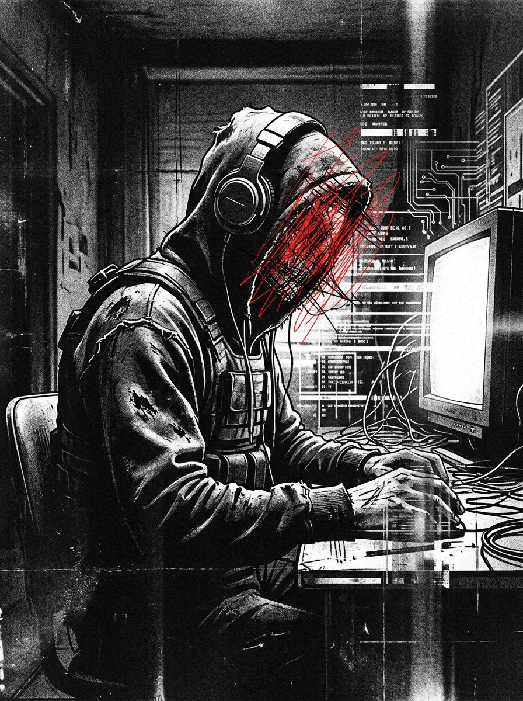

# Zero Sum RPG Scenario: The Pay-Per-View Flash Mob

## Real-World Inspiration
Dit scenario is sterk geanonimiseerd, maar conceptueel afgeleid van actuele wereldwijde gebeurtenissen met betrekking tot: **Influencer-events die fysieke rellen veroorzaken en de politie omzeilen**. Het integreert moderne digitale demagoog-mechanics en corporate overreach.

## 1. The Hook
De spelers worden ingehuurd om een zwaar beveiligde Mega-Arena in Londen te infiltreren. Een invloedrijke **Viral Prankster** heeft hun parasociale zwerm van miljoenen volgers ingezet als een onwetend schild voor een illegale operatie die binnen plaatsvindt. De autoriteiten zullen niet ingrijpen uit angst voor een massale PR-ramp en rellen.

## 2. De Digitale Demagoog
De primaire antagonist is geen zwaarbewapende warlord, maar een influencer die de aandacht controleert. Ze gebruiken geen wapens; ze gebruiken live-streams. Als de spelers worden ontdekt, zal de influencer hun gezichten onmiddellijk uitzenden, wat de Social Heat direct tot het maximum verhoogt en ze wereldwijd doxt.

## 3. De Complicatie
Geweld is hier geen optie. *Als alternatief kan de Faceless een DC 3 Subterfuge check proberen om een gelokaliseerde bypass-code te vervalsen, om zo de confrontatie volledig te vermijden.* **10.000 in paniek rakende fans maken kinetische Action onmogelijk.**
Als er ook maar één enkel schot wordt gelost, is de Dead Man's Zone regel van toepassing, en zullen de spelers een onmogelijke Extraction tegemoetzien tegen een overweldigende overmacht.

## 4. Zero Sum Consistency Matrix (ZSCM)
Om ervoor te zorgen dat het scenario de meedogenloze asymmetrie van het *Zero Sum* systeem behoudt, zijn de ZSCM-waarden vooraf berekend:

* **Antagonist Power (E):** 7/10
* **Player Starting Resources (R):** 4/10
* **Initial Intel Asymmetry (I):** 7/10
* **Collateral Damage Risk (D):** 6/10
* **Total Stress Score:** 24/30 (Geldig: Mechanisch oplosbaar maar asymmetrisch)

## 5. Objectives & Extraction
1. **Infiltrate:** Omzeil de fysieke beveiliging zonder de volgers-zwerm te alarmeren.
2. **Isolate:** Koppel de influencer los van het wereldwijde netwerk om de uitzenddreiging te stoppen.
3. **Extract:** Stel de Objective-data veilig en verdwijn voordat de algoritmische politiereactie arriveert.
