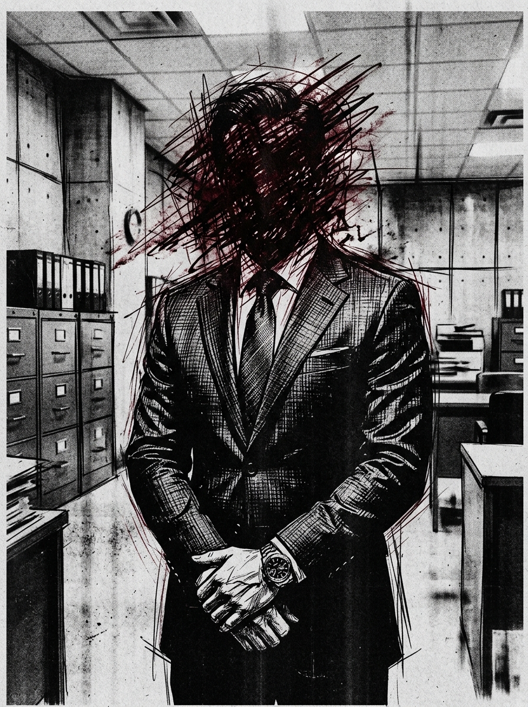

# Zero Sum RPG Scenario: The Phantom Click

## Real-World Inspiration
Dit scenario is zwaar geanonimiseerd maar conceptueel afgeleid van actuele wereldwijde evenementen met betrekking tot: **Zero-click spyware die overheidsfunctionarissen infecteert**. Het integreert moderne digital demagogue mechanics en corporate overreach.

## 1. The Hook
De players zijn ingehuurd om een zwaarbeveiligde Genève Freeport te infiltreren. Een invloedrijke **Viral Prankster** heeft zijn parasociale zwerm van miljoenen volgers omgevormd tot een onwetend schild voor een illegale operatie die binnen plaatsvindt. De autoriteiten zullen niet ingrijpen uit angst voor een massale PR-ramp en rellen.

## 2. The Digital Demagogue
De primaire antagonist is geen zwaarbewapende warlord, maar een influencer die aandacht opeist. Ze gebruiken geen vuurwapens; ze gebruiken live-streams. Als de players worden ontdekt, zal de influencer onmiddellijk hun gezichten broadcasten, waardoor de Social Heat meteen naar het maximum stijgt en ze wereldwijd worden gedoxxt.

## 3. The Complication
Geweld is hier geen optie. *Als alternatief kan de Faceless een DC 3 Subterfuge check proberen om een lokale bypass code te vervalsen en de confrontatie volledig te vermijden.* **De faciliteit gebruikt biometrische sound-locks. Geen vuurwapens toegestaan.**
Als er één enkel schot valt, treedt de Dead Man's Zone regel in werking, en zullen de players voor een onmogelijke extraction komen te staan tegenover een overweldigende overmacht.

## 4. Zero Sum Consistency Matrix (ZSCM)
Om ervoor te zorgen dat het scenario de meedogenloze asymmetrie van het *Zero Sum* systeem behoudt, zijn de ZSCM waarden vooraf berekend:

* **Antagonist Power (E):** 8/10
* **Player Starting Resources (R):** 7/10
* **Initial Intel Asymmetry (I):** 5/10
* **Collateral Damage Risk (D):** 6/10
* **Total Stress Score:** 26/30 (Valid: Mechanically Solvable but Asymmetric)

## 5. Objectives & Extraction
1. **Infiltrate:** Bypass de fysieke security zonder de volgers-zwerm te alarmeren.
2. **Isolate:** Koppel de influencer los van het globale network om de broadcast dreiging te stoppen.
3. **Extract:** Stel de objective data veilig en verdwijn voordat de algoritmische police response arriveert.
