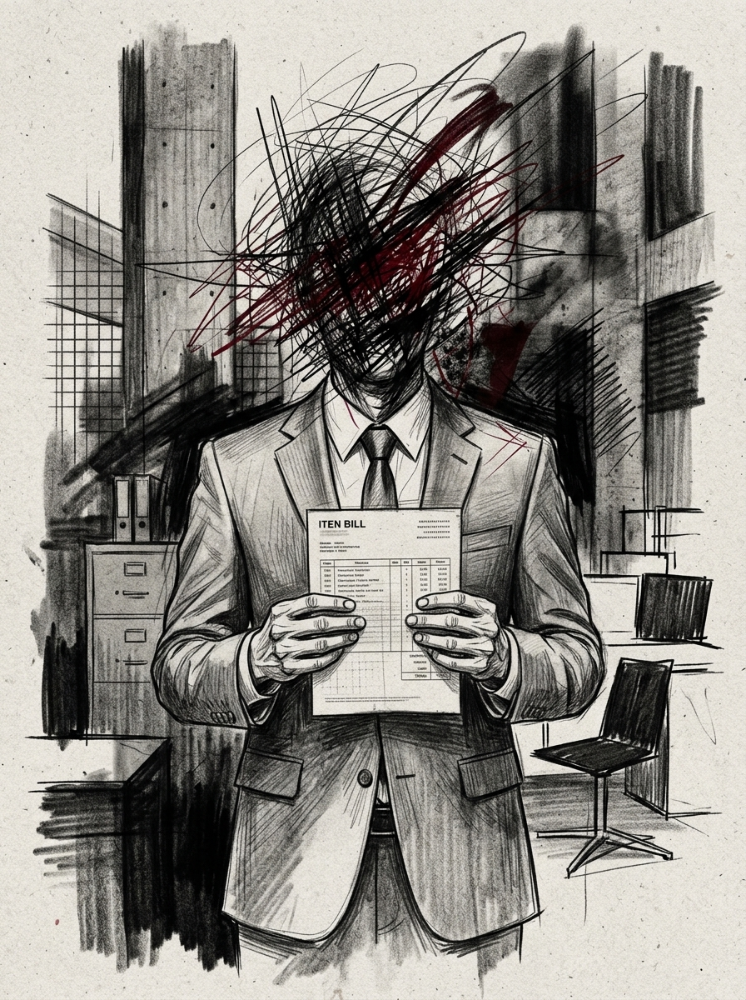

# Zero Sum RPG Scenario: The Ego Brawl

## Real-World Inspiration
Dieses Szenario ist stark anonymisiert, aber konzeptionell von aktuellen weltweiten Ereignissen abgeleitet: **Tech-Milliardäre, die private Militärunternehmen für persönliche Fehden nutzen**. Es integriert moderne Digital-Demagogen-Mechaniken und unternehmerische Übergriffigkeit.

## 1. The Hook
Die Players werden angeheuert, um eine hochsichere Privatinsel im Pazifik zu infiltrieren. Ein einflussreicher **Political Streamer** hat seinen parasozialen Schwarm von Millionen von Followern als unwissentlichen Schutzschild für eine illegale Operation im Inneren instrumentalisiert. Die Behörden werden aus Angst vor einem massiven PR-Desaster und Unruhen nicht eingreifen.

## 2. The Digital Demagogue
Der primäre Antagonist ist kein schwer bewaffneter Warlord, sondern ein Influencer, der Aufmerksamkeit kommandiert. Sie benutzen keine Schusswaffen; sie nutzen Live-Streams. Wenn die Players entdeckt werden, wird der Influencer sofort ihre Gesichter übertragen, die Social Heat auf das Maximum erhöhen und sie global doxxen.

## 3. The Complication
Gewalt ist hier keine Option. *Alternativ kann der Faceless einen DC 3 Subterfuge check versuchen, um einen lokalisierten Bypass-Code zu fälschen und die Konfrontation komplett zu vermeiden.* **Zwei rivalisierende PMC-Fraktionen schießen bereits aufeinander.**
Wenn auch nur ein einziger Schuss abgefeuert wird, gilt die Dead Man's Zone-Regel, und die Players stehen vor einer unmöglichen Extraktion gegen eine Übermacht.

## 4. Zero Sum Consistency Matrix (ZSCM)
Um sicherzustellen, dass das Szenario die brutale Asymmetrie des *Zero Sum*-Systems beibehält, werden die ZSCM-Werte im Voraus berechnet:

* **Antagonist Power (E):** 8/10
* **Player Starting Resources (R):** 4/10
* **Initial Intel Asymmetry (I):** 5/10
* **Collateral Damage Risk (D):** 5/10
* **Total Stress Score:** 22/30 (Valid: Mechanically Solvable but Asymmetric)

## 5. Objectives & Extraction
1. **Infiltrate:** Umgehe die physische Sicherheit, ohne den Follower-Schwarm zu alarmieren.
2. **Isolate:** Trenne den Influencer vom globalen Netzwerk, um die Übertragungsbedrohung zu stoppen.
3. **Extract:** Sichere die Zieldaten und verschwinde, bevor die algorithmische Polizeireaktion eintrifft.
