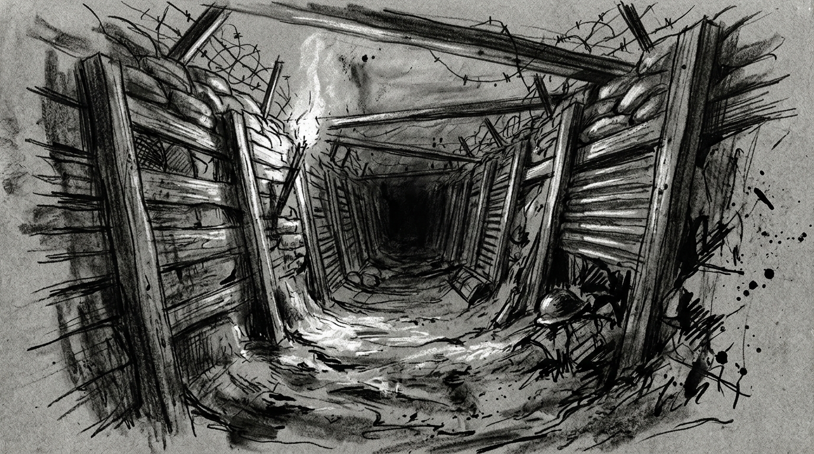

# Zero Sum RPG Scenario: The Fake Philanthropist

## Real-World Inspiration
Dit scenario is zwaar geanonimiseerd, maar conceptueel afgeleid van actuele wereldwijde gebeurtenissen met betrekking tot: **Influencer charity scams die proxy-oorlogen financieren**. Het integreert moderne Digital Demagogue mechanics en corporate overreach.

## 1. The Hook
De spelers zijn ingehuurd om een zwaar beveiligd Charity Gala in Monaco te infiltreren. Een invloedrijke **Lifestyle Vlogger** heeft haar parasociale zwerm van miljoenen volgers ingezet als een onwetend schild voor een illegale operatie die binnen plaatsvindt. De autoriteiten zullen niet ingrijpen uit angst voor een enorme PR-ramp en rellen.

## 2. The Digital Demagogue
De primaire antagonist is geen zwaarbewapende warlord, maar een influencer die aandacht afdwingt. Ze gebruiken geen geweren; ze gebruiken live-streams. Als de spelers worden ontdekt, zal de influencer onmiddellijk hun gezichten uitzenden, waardoor de Social Heat direct tot het maximum stijgt en ze wereldwijd worden gedoxxt.

## 3. The Complication
Geweld is hier geen optie. *Als alternatief kan de Faceless een DC 3 Subterfuge check proberen om een gelokaliseerde bypass code te forgen, waardoor de confrontatie volledig wordt vermeden.* **High society omgeving: Het Heat niveau springt naar maximaal als de cover wordt doorbroken.**
Als er één schot wordt gelost, is de Dead Man's Zone-regel van toepassing en staan de spelers voor een onmogelijke extractie tegen een overmacht.

## 4. Zero Sum Consistency Matrix (ZSCM)
Om ervoor te zorgen dat het scenario de meedogenloze asymmetrie van het *Zero Sum* systeem behoudt, zijn de ZSCM waarden vooraf berekend:

* **Antagonist Power (E):** 6/10
* **Player Starting Resources (R):** 4/10
* **Initial Intel Asymmetry (I):** 4/10
* **Collateral Damage Risk (D):** 5/10
* **Total Stress Score:** 19/30 (Valid: Mechanically Solvable but Asymmetric)

## 5. Objectives & Extraction
1. **Infiltrate:** Omzeil de fysieke beveiliging zonder de volgerszwerm te alarmeren.
2. **Isolate:** Koppel de influencer los van het wereldwijde netwerk om de broadcast-dreiging te stoppen.
3. **Extract:** Stel de objective data veilig en verdwijn voordat de algoritmische politiereactie arriveert.
