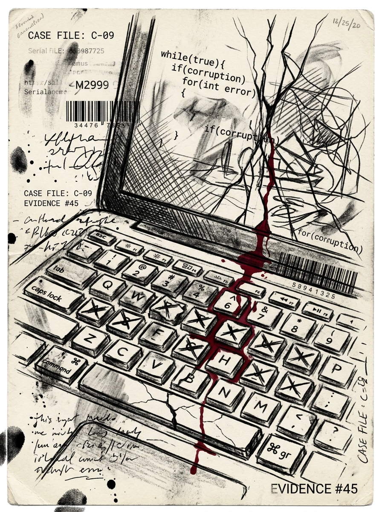

# Zero Sum RPG Scenario: The Neural Hack

## Real-World Inspiration
Dit Scenario is sterk geanonimiseerd, maar conceptueel afgeleid van actuele wereldwijde gebeurtenissen met betrekking tot: **Experimentele brain-computer interfaces die toevallen veroorzaken**. Het integreert moderne Digital Demagogue mechanics en Corporate Overreach.

## 1. The Hook
De Players worden ingehuurd om een zwaar beveiligde Underground Clinic in Tokio te infiltreren. Een invloedrijke **Tech Reviewer** heeft zijn parasociale Swarm van miljoenen volgers gemilitariseerd als een onwetend schild voor een illegale operatie die daarbinnen plaatsvindt. De autoriteiten zullen niet ingrijpen uit angst voor een enorme PR-ramp en rellen.

## 2. The Digital Demagogue
De primaire Antagonist is geen zwaarbewapende warlord, maar een influencer die aandacht afdwingt. Ze gebruiken geen wapens; ze gebruiken live-streams. Als de Players worden ontdekt, zal de influencer onmiddellijk hun gezichten broadcasten, waardoor de Social Heat direct tot het maximum stijgt en ze wereldwijd worden gedoxt.

## 3. The Complication
Geweld is hier geen optie. *Als alternatief kunnen de Players Deep Cover inzetten om de bewaker volledig te omzeilen door een DC 2 Subterfuge check te halen.* **Patiënten zijn zeer onstabiel. Elk hard geluid veroorzaakt massale paniek.**
Als er één schot wordt gelost, is de Dead Man's Zone regel van toepassing, en de Players komen tegenover een onmogelijke Extraction te staan tegen een overweldigende overmacht.

## 4. Zero Sum Consistency Matrix (ZSCM)
Om ervoor te zorgen dat het Scenario de meedogenloze asymmetrie van het *Zero Sum* systeem behoudt, zijn de ZSCM-waarden vooraf berekend:

* **Antagonist Power (E):** 5/10
* **Player Starting Resources (R):** 4/10
* **Initial Intel Asymmetry (I):** 5/10
* **Collateral Damage Risk (D):** 7/10
* **Total Stress Score:** 21/30 (Valid: Mechanically Solvable but Asymmetric)

## 5. Objectives & Extraction
1. **Infiltrate:** Omzeil de fysieke Security zonder de volgers-Swarm te alarmeren.
2. **Isolate:** Ontkoppel de influencer van het globale network om de Broadcast dreiging te stoppen.
3. **Extract:** Stel de Objective Data veilig en verdwijn voordat de algoritmische Police Response arriveert.
