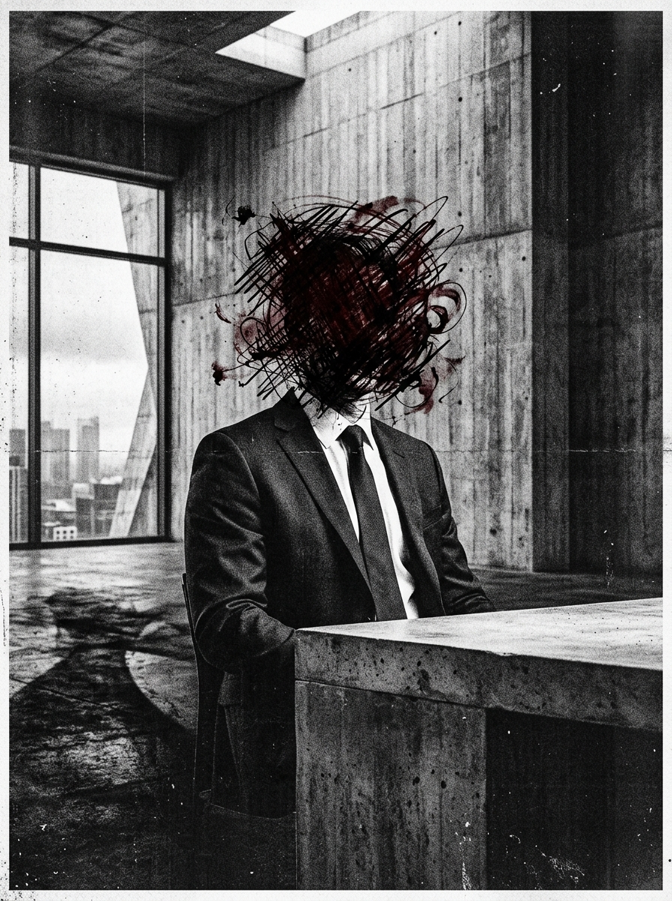

# Zero Sum RPG Scenario: The Art Vault

## Real-World Inspiration
This scenario is heavily anonymized but conceptually derived from current worldwide events regarding: **Freeports storing stolen data disguised as NFTs**. It integrates modern digital demagogue mechanics and corporate overreach.

## 1. The Hook
The players are contracted to infiltrate a highly secure Zurich Underground Vault. An influential **Financial Guru** has weaponized their parasocial swarm of millions of followers to act as an unwitting shield for an illegal operation happening inside. The authorities will not intervene out of fear of a massive PR disaster and riots.

## 2. The Digital Demagogue
The primary antagonist isn't a heavily armed warlord, but an influencer who commands attention. They don't use guns; they use live-streams. If the players are detected, the influencer will immediately broadcast their faces, instantly raising the Social Heat to maximum and doxxing them globally.

## 3. The Complication
Violence is not an option here. *Alternatively, the Faceless can attempt a DC 3 Subterfuge check to forge a localized bypass code, avoiding the confrontation entirely.* **Oxygen is depleted in the vault to prevent fires; characters will suffocate.**
If a single shot is fired, the Dead Man's Zone rule applies, and the players will face an impossible extraction against overwhelming force.

## 4. Zero Sum Consistency Matrix (ZSCM)
To ensure the scenario maintains the brutal asymmetry of the *Zero Sum* system, the ZSCM values are pre-calculated:

* **Antagonist Power (E):** 9/10
* **Player Starting Resources (R):** 6/10
* **Initial Intel Asymmetry (I):** 4/10
* **Collateral Damage Risk (D):** 4/10
* **Total Stress Score:** 23/30 (Valid: Mechanically Solvable but Asymmetric)

## 5. Objectives & Extraction
1. **Infiltrate:** Bypass the physical security without alerting the follower swarm.
2. **Isolate:** Disconnect the influencer from the global network to stop the broadcast threat.
3. **Extract:** Secure the objective data and vanish before the algorithmic police response arrives.
