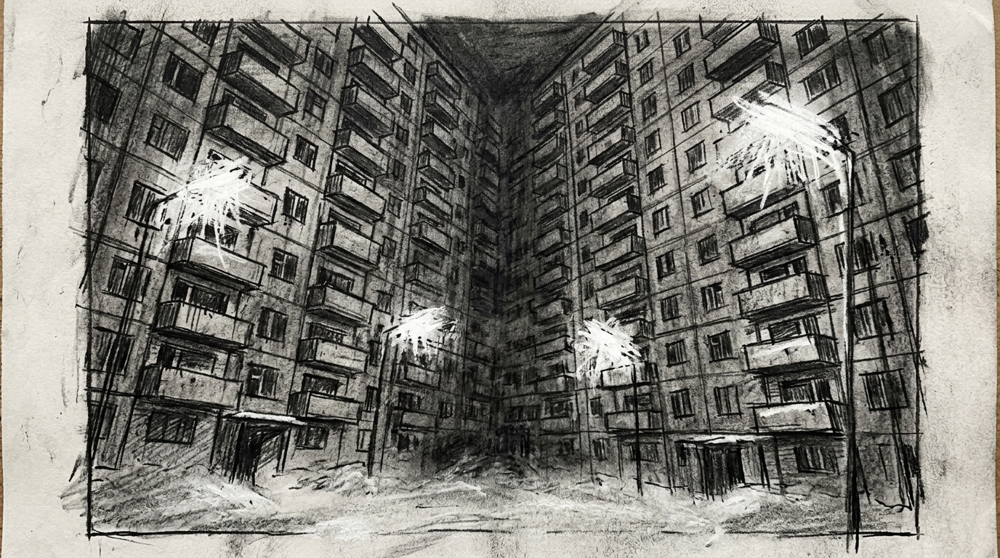

# Zero Sum RPG Szenario: The Digital Panopticon

## Real-World Inspiration
Dieses Szenario ist stark anonymisiert, aber konzeptionell abgeleitet von aktuellen weltweiten Ereignissen bezüglich: **Smart Glasses, die alles in Echtzeit aufzeichnen und hochladen**. Es integriert moderne digitale Demagogen-Mechaniken und Corporate Overreach.

## 1. The Hook
Die Spieler werden angeheuert, um ein hochsicheres Metropolitan Subway System zu infiltrieren. Ein einflussreicher **Lifestyle Vlogger** hat seinen parasozialen Schwarm von Millionen von Followern als unwissenden Schutzschild für eine illegale Operation, die im Inneren stattfindet, als Waffe eingesetzt. Die Behörden werden aus Angst vor einem massiven PR-Desaster und Unruhen nicht eingreifen.

## 2. Der Digitale Demagoge
Der primäre Antagonist ist kein schwer bewaffneter Warlord, sondern ein Influencer, der Aufmerksamkeit kontrolliert. Sie benutzen keine Waffen; sie benutzen Live-Streams. Wenn die Spieler entdeckt werden, wird der Influencer sofort ihre Gesichter übertragen, was die Social Heat sofort auf das Maximum ansteigen lässt und sie global doxt.

## 3. Die Komplikation
Gewalt ist hier keine Option. *Alternativ können die Spieler Deep Cover nutzen, um die Wachen komplett zu umgehen, indem sie einen DC 2 Subterfuge Check bestehen.* **Millionen von Aufnahmegeräten; absolute Stealth ist ohne EMPs unmöglich.**
Wenn auch nur ein einziger Schuss fällt, greift die Dead Man's Zone Regel, und die Spieler müssen sich einer unmöglichen Extraktion gegen eine überwältigende Übermacht stellen.

## 4. Zero Sum Consistency Matrix (ZSCM)
Um sicherzustellen, dass das Szenario die brutale Asymmetrie des *Zero Sum* Systems beibehält, sind die ZSCM-Werte vorberechnet:

* **Antagonist Power (E):** 7/10
* **Player Starting Resources (R):** 6/10
* **Initial Intel Asymmetry (I):** 5/10
* **Collateral Damage Risk (D):** 4/10
* **Total Stress Score:** 22/30 (Gültig: Mechanisch lösbar, aber asymmetrisch)

## 5. Objectives & Extraction
1. **Infiltrate:** Umgehe die physische Sicherheit, ohne den Follower-Schwarm zu alarmieren.
2. **Isolate:** Trenne den Influencer vom globalen Netzwerk, um die Übertragungsbedrohung zu stoppen.
3. **Extract:** Sichere die Objective-Daten und verschwinde, bevor die algorithmische Polizeiantwort eintrifft.
