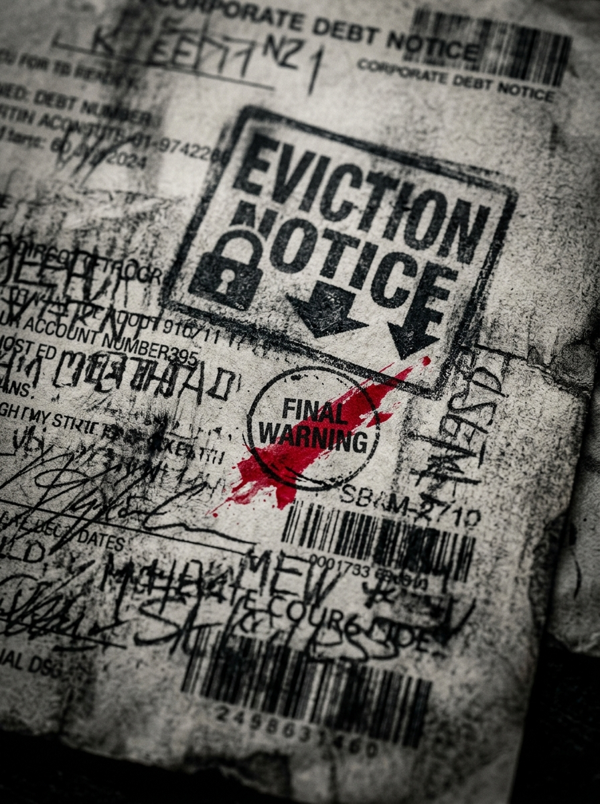

# Zero Sum RPG Scenario: The Blackout Ransom

## Real-World Inspiration
Dieses Szenario ist stark anonymisiert, aber konzeptionell abgeleitet von aktuellen weltweiten Ereignissen bezüglich: **Grid-Hacker, die damit drohen, eine Stadt im Winter einfrieren zu lassen**. Es integriert moderne Digital Demagogue-Mechaniken und Corporate Overreach.

## 1. The Hook
Die Spieler werden angeheuert, um ein hochsicheres Power Grid Control Center zu infiltrieren. Ein einflussreicher **Political Streamer** hat seinen parasozialen Schwarm von Millionen von Followern als unwissendes Schutzschild für eine illegale Operation missbraucht, die im Inneren stattfindet. Die Behörden werden aus Angst vor einem massiven PR-Desaster und Unruhen nicht eingreifen.

## 2. The Digital Demagogue
Der primäre Antagonist ist kein schwer bewaffneter Warlord, sondern ein Influencer, der die Aufmerksamkeit auf sich zieht. Sie benutzen keine Schusswaffen; sie benutzen Live-Streams. Wenn die Spieler entdeckt werden, wird der Influencer sofort ihre Gesichter broadcasten, was die Social Heat sofort auf das Maximum erhöht und sie global doxt.

## 3. The Complication
Gewalt ist hier keine Option. *Alternativ können die Spieler Deep Cover einsetzen, um die Guards durch einen DC 2 Subterfuge Check komplett zu umgehen.* **Das Ziel ist mit einem Dead-Man Switch an das Grid gekoppelt; ihr Tod löst den Blackout aus.**
Wenn ein einziger Schuss abgefeuert wird, gilt die Dead Man's Zone Rule und die Spieler stehen vor einer unmöglichen Extraction gegen eine überwältigende Übermacht.

## 4. Zero Sum Consistency Matrix (ZSCM)
Um sicherzustellen, dass das Szenario die brutale Asymmetrie des *Zero Sum*-Systems beibehält, sind die ZSCM-Werte vorberechnet:

* **Antagonist Power (E):** 5/10
* **Player Starting Resources (R):** 6/10
* **Initial Intel Asymmetry (I):** 7/10
* **Collateral Damage Risk (D):** 6/10
* **Total Stress Score:** 24/30 (Valid: Mechanisch lösbar, aber asymmetrisch)

## 5. Objectives & Extraction
1. **Infiltrate:** Die physische Security umgehen, ohne den Follower-Schwarm zu alarmieren.
2. **Isolate:** Den Influencer vom globalen Network trennen, um die Broadcast-Gefahr zu stoppen.
3. **Extract:** Die Objective Data sichern und verschwinden, bevor die algorithmische Police Response eintrifft.
