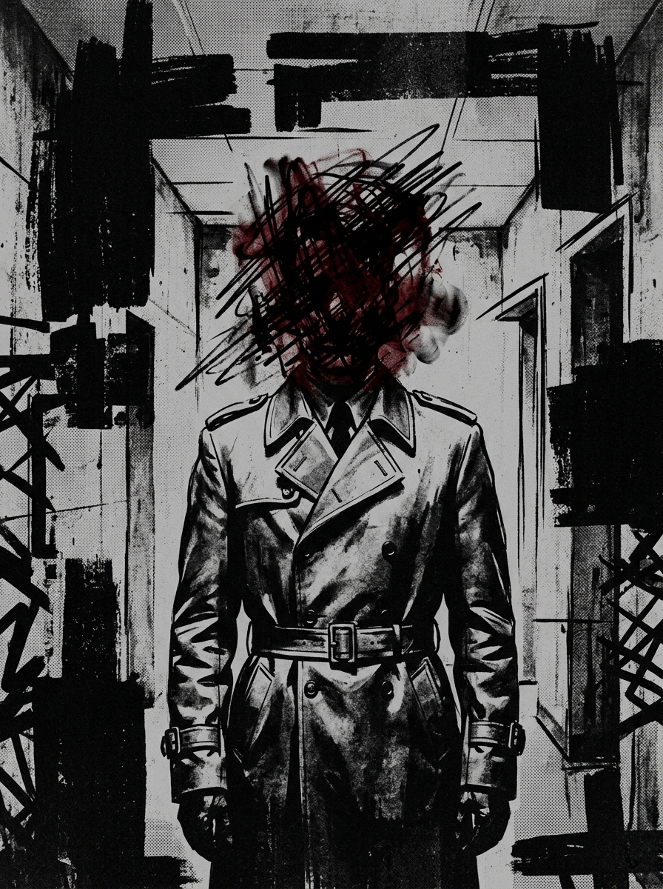
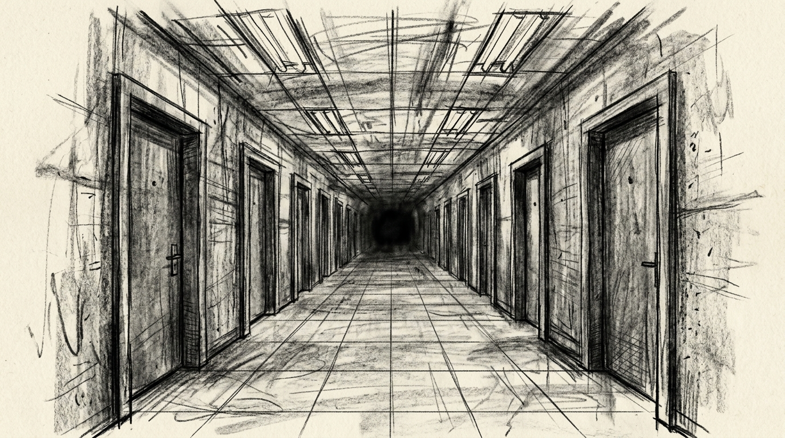

# Zero Sum RPG Scenario: The Memory Market

## Real-World Inspiration
Dit scenario is sterk geanonimiseerd, maar conceptueel afgeleid van actuele wereldwijde gebeurtenissen met betrekking tot: **Chantage gebaseerd op illegale AR-recordings van privémomenten**. Het integreert moderne digital demagogue mechanics en corporate overreach.

## 1. The Hook
De spelers worden ingehuurd om een zwaarbeveiligde High-End AR Club te infiltreren. Een invloedrijke **Lifestyle Vlogger** heeft zijn parasociale swarm van miljoenen volgers bewapend om te fungeren als een onwetend schild voor een illegale operatie die binnenin plaatsvindt. De autoriteiten zullen niet ingrijpen uit angst voor een massale PR-ramp en riots.

## 2. The Digital Demagogue
De primaire antagonist is geen zwaarbewapende warlord, maar een influencer die aandacht opeist. Ze gebruiken geen geweren; ze gebruiken live-streams. Als de spelers worden ontdekt, zal de influencer onmiddellijk hun gezichten uitzenden, waardoor de Social Heat direct tot het maximum stijgt en ze wereldwijd worden gedoxt.

## 3. The Complication
Geweld is hier geen optie. *Als alternatief kan de Faceless een DC 3 Subterfuge check proberen om een gelokaliseerde bypass code te smeden, waardoor de confrontatie volledig wordt vermeden.* **De omgeving is een sensory overload; Perception checks zijn bijna onmogelijk.**
Als er één enkel schot wordt gelost, is de Dead Man's Zone rule van toepassing en staan de spelers voor een onmogelijke extraction tegen een overweldigende overmacht.

## 4. Zero Sum Consistency Matrix (ZSCM)
Om ervoor te zorgen dat het scenario de meedogenloze asymmetrie van het *Zero Sum* systeem behoudt, zijn de ZSCM-waarden vooraf berekend:

* **Antagonist Power (E):** 5/10
* **Player Starting Resources (R):** 5/10
* **Initial Intel Asymmetry (I):** 4/10
* **Collateral Damage Risk (D):** 7/10
* **Total Stress Score:** 21/30 (Valid: Mechanisch op te lossen maar asymmetrisch)

## 5. Objectives & Extraction
1. **Infiltrate:** Omzeil de fysieke security zonder de follower swarm te alarmeren.
2. **Isolate:** Ontkoppel de influencer van het wereldwijde netwerk om de broadcast threat te stoppen.
3. **Extract:** Stel de objective data veilig en verdwijn voordat de algoritmische police response arriveert.
