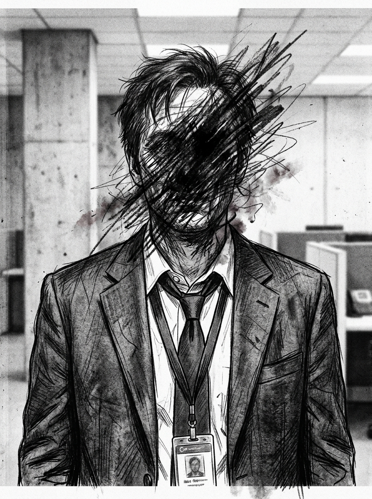

# Zero Sum RPG Scenario: The Code Mercenaries

## Real-World Inspiration
Dieses Szenario ist stark anonymisiert, aber konzeptionell abgeleitet von aktuellen weltweiten Ereignissen in Bezug auf: **Hackers for Hire, die Krankenhaussysteme als Geiseln halten**. Es integriert moderne Digital Demagogue-Mechaniken und Corporate Overreach.

## 1. The Hook
Die Spieler werden angeheuert, um eine hochsichere Abandoned Subway Station zu infiltrieren. Ein einflussreicher **Tech Reviewer** hat seinen parasozialen Schwarm von Millionen Followern als unwissenden Schild für eine illegale Operation, die im Inneren stattfindet, als Waffe eingesetzt. Die Behörden werden aus Angst vor einem massiven PR-Desaster und Unruhen nicht eingreifen.

## 2. The Digital Demagogue
Der primäre Antagonist ist kein schwerbewaffneter Warlord, sondern ein Influencer, der Aufmerksamkeit kontrolliert. Er nutzt keine Schusswaffen; er nutzt Live-Streams. Wenn die Spieler entdeckt werden, wird der Influencer sofort ihre Gesichter senden, wodurch die Social Heat schlagartig auf das Maximum ansteigt und sie global gedoxxt werden.

## 3. The Complication
Gewalt ist hier keine Option. *Alternativ können die Spieler Deep Cover nutzen, um die Wache komplett zu umgehen, indem sie einen DC 2 Subterfuge check bestehen.* **Das Gebiet ist stark mit improvisierten Sprengsätzen (booby-trapped) versehen.**
Fällt ein einziger Schuss, greift die Dead Man's Zone-Regel, und die Spieler sehen sich einer unmöglichen Extraktion gegen eine Übermacht gegenüber.

## 4. Zero Sum Consistency Matrix (ZSCM)
Um sicherzustellen, dass das Szenario die brutale Asymmetrie des *Zero Sum* Systems beibehält, sind die ZSCM-Werte vorberechnet:

* **Antagonist Power (E):** 6/10
* **Player Starting Resources (R):** 5/10
* **Initial Intel Asymmetry (I):** 7/10
* **Collateral Damage Risk (D):** 6/10
* **Total Stress Score:** 24/30 (Valid: Mechanically Solvable but Asymmetric)

## 5. Objectives & Extraction
1. **Infiltrate:** Umgehe die physische Sicherheit, ohne den Follower-Schwarm zu alarmieren.
2. **Isolate:** Trenne den Influencer vom globalen Netzwerk, um die Broadcast-Bedrohung zu stoppen.
3. **Extract:** Sichere die Objective-Daten und verschwinde, bevor die algorithmische Polizeiantwort eintrifft.
