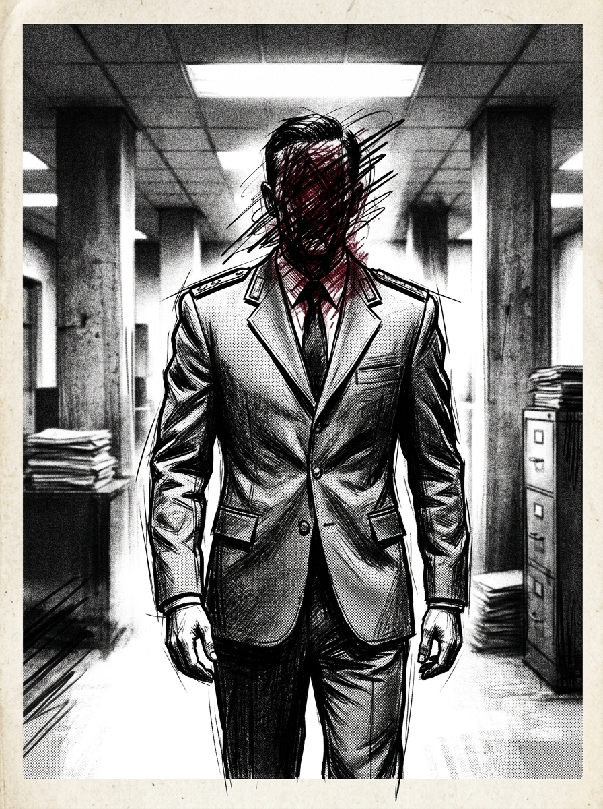

# Zero Sum RPG Scenario: The Digital Prophet

## Real-World Inspiration
Dit scenario is sterk geanonimiseerd, maar conceptueel afgeleid van actuele wereldwijde gebeurtenissen met betrekking tot: **Een AI die door een online cultus als godheid wordt vereerd**. Het integreert moderne digitale demagoog mechanics en corporate overreach.

## 1. The Hook
De players worden ingehuurd om een zwaarbeveiligd Cult Compound te infiltreren. Een invloedrijke **Lifestyle Vlogger** heeft zijn parasociale zwerm van miljoenen volgers ingezet als een onwetend schild voor een illegale operatie die binnen plaatsvindt. De autoriteiten zullen niet ingrijpen uit angst voor een enorme PR-ramp en rellen.

## 2. De Digitale Demagoog
De primaire antagonist is geen zwaarbewapende warlord, maar een influencer die de aandacht opeist. Ze gebruiken geen geweren; ze gebruiken livestreams. Als de players worden gedetecteerd, zal de influencer onmiddellijk hun gezichten uitzenden, waardoor de Social Heat direct naar het maximum stijgt en ze wereldwijd worden gedoxxt.

## 3. De Complicatie
Geweld is hier geen optie. *Als alternatief kan de Face een DC 3 Subterfuge check proberen om een gelokaliseerde bypass-code te vervalsen, waardoor de confrontatie volledig wordt vermeden.* **Cultleden zijn zeer toegewijd en zullen op de players zwermen.**
Als er één schot wordt gelost, is de Dead Man's Zone regel van toepassing en worden de players geconfronteerd met een onmogelijke extractie tegen een overweldigende overmacht.

## 4. Zero Sum Consistency Matrix (ZSCM)
Om ervoor te zorgen dat het scenario de meedogenloze asymmetrie van het *Zero Sum* systeem behoudt, zijn de ZSCM-waarden vooraf berekend:

* **Antagonist Power (E):** 7/10
* **Player Starting Resources (R):** 6/10
* **Initial Intel Asymmetry (I):** 5/10
* **Collateral Damage Risk (D):** 7/10
* **Total Stress Score:** 25/30 (Geldig: Mechanisch oplosbaar maar asymmetrisch)

## 5. Doelen & Extractie
1. **Infiltreren:** De fysieke beveiliging omzeilen zonder de volgerszwerm te alarmeren.
2. **Isoleren:** De influencer loskoppelen van het wereldwijde netwerk om de uitzendbedreiging te stoppen.
3. **Extraheren:** De doelgegevens veiligstellen en verdwijnen voordat de algoritmische politiereactie arriveert.
