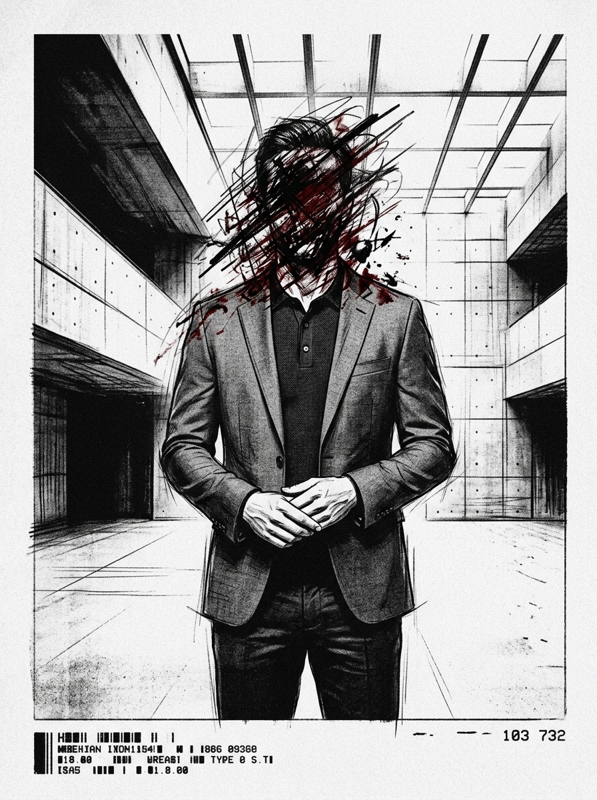

# Zero Sum RPG Scenario: The Identity Thief

## Real-World Inspiration
Dieses Scenario ist stark anonymisiert, aber konzeptionell abgeleitet von aktuellen weltweiten Ereignissen bezüglich: **Biometrie stehlen, um die Existenz einer Person komplett auszulöschen**. Es integriert moderne Digital-Demagogue-Mechaniken und Corporate Overreach.

## 1. The Hook
Die Players werden angeheuert, um ein hochsicheres Data Processing Center zu infiltrieren. Ein einflussreicher **Lifestyle Vlogger** hat seinen parasozialen Schwarm von Millionen Followern zu einem unwissenden Schild für eine illegale Operation im Inneren gemacht. Die Behörden werden aus Angst vor einem massiven PR-Desaster und Unruhen nicht eingreifen.

## 2. The Digital Demagogue
Der primäre Antagonist ist kein schwer bewaffneter Warlord, sondern ein Influencer, der Aufmerksamkeit kommandiert. Sie benutzen keine Schusswaffen; sie benutzen Live-Streams. Wenn die Players entdeckt werden, wird der Influencer sofort ihre Gesichter broadcasten, was die Social Heat sofort auf das Maximum erhöht und sie weltweit doxt.

## 3. The Complication
Gewalt ist hier keine Option. *Alternativ kann der Faceless versuchen, einen DC 3 Subterfuge Check durchzuführen, um einen lokalen Bypass Code zu fälschen und der Konfrontation komplett aus dem Weg zu gehen.* **Die Einrichtung erfordert ständige biometrische Verifikation, um sich zwischen Räumen zu bewegen.**
Wenn ein einziger Schuss fällt, tritt die Dead Man's Zone Regel in Kraft und die Players müssen sich einer unmöglichen Extraction gegen eine überwältigende Übermacht stellen.

## 4. Zero Sum Consistency Matrix (ZSCM)
Um sicherzustellen, dass das Scenario die brutale Asymmetrie des *Zero Sum* Systems beibehält, sind die ZSCM-Werte vorberechnet:

* **Antagonist Power (E):** 7/10
* **Player Starting Resources (R):** 5/10
* **Initial Intel Asymmetry (I):** 5/10
* **Collateral Damage Risk (D):** 4/10
* **Total Stress Score:** 21/30 (Valid: Mechanically Solvable but Asymmetric)

## 5. Objectives & Extraction
1. **Infiltrate:** Die physische Security bypassen, ohne den Follower-Schwarm zu alarmieren.
2. **Isolate:** Den Influencer vom globalen Netzwerk trennen, um die Broadcast-Bedrohung zu stoppen.
3. **Extract:** Die Objective Data sichern und verschwinden, bevor die algorithmische Police Response eintrifft.
