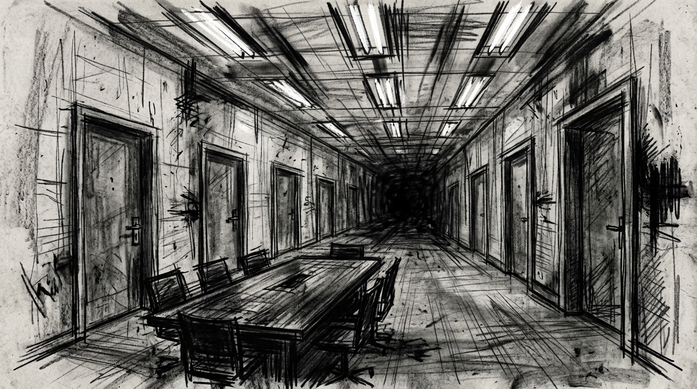

# Zero Sum RPG Scenario: The Synthetic Workforce

## Real-World Inspiration
Dieses Szenario ist stark anonymisiert, basiert jedoch konzeptionell auf aktuellen weltweiten Ereignissen bezüglich: **Androids, die Human Labor ersetzen und massive Unrest verursachen**. Es integriert moderne Digital Demagogue Mechanics und Corporate Overreach.

## 1. The Hook
Die Spieler werden angeheuert, um eine hochsichere Automated Factory zu infiltrieren. Ein einflussreicher **Tech Reviewer** hat seinen parasozialen Swarm von Millionen Followern als unwissendes Schild für eine illegale Operation im Inneren bewaffnet. Die Behörden werden aus Angst vor einem massiven PR-Desaster und Riots nicht intervenieren.

## 2. The Digital Demagogue
Der primäre Antagonist ist kein schwer bewaffneter Warlord, sondern ein Influencer, der Aufmerksamkeit kommandiert. Sie benutzen keine Waffen; sie nutzen Live-Streams. Wenn die Spieler detectet werden, wird der Influencer sofort ihre Gesichter broadcasten, was das Social Heat Level instant auf Maximum bringt und sie global doxxt.

## 3. The Complication
Violence ist hier keine Option. *Alternativ können the Faceless einen DC 3 Subterfuge Check versuchen, um einen lokalisierten Bypass Code zu forgen und der Konfrontation komplett auszuweichen.* **Die Androids sind networked; einen zu alarmieren bedeutet, alle zu alarmieren.**
Wenn ein einziger Schuss abgefeuert wird, greift die Dead Man's Zone Rule, und die Spieler stehen vor einer unmöglichen Extraction gegen Overwhelming Force.

## 4. Zero Sum Consistency Matrix (ZSCM)
Um sicherzustellen, dass das Szenario die brutale Asymmetrie des *Zero Sum* Systems beibehält, sind die ZSCM Values vorberechnet:

* **Antagonist Power (E):** 5/10
* **Player Starting Resources (R):** 5/10
* **Initial Intel Asymmetry (I):** 4/10
* **Collateral Damage Risk (D):** 4/10
* **Total Stress Score:** 18/30 (Valid: Mechanically Solvable but Asymmetric)

## 5. Objectives & Extraction
1. **Infiltrate:** Bypasse die physische Security, ohne den Follower Swarm zu alarmieren.
2. **Isolate:** Disconnecte den Influencer vom Global Network, um die Broadcast Threat zu stoppen.
3. **Extract:** Sichere die Objective Data und verschwinde, bevor die Algorithmic Police Response eintrifft.
