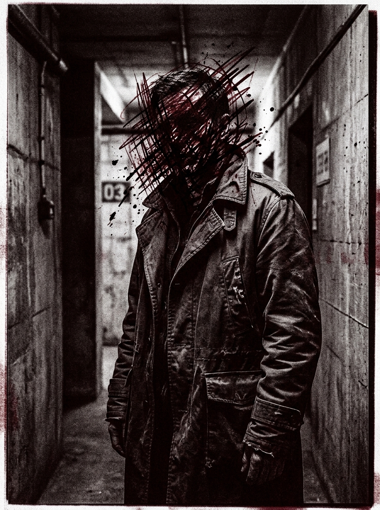
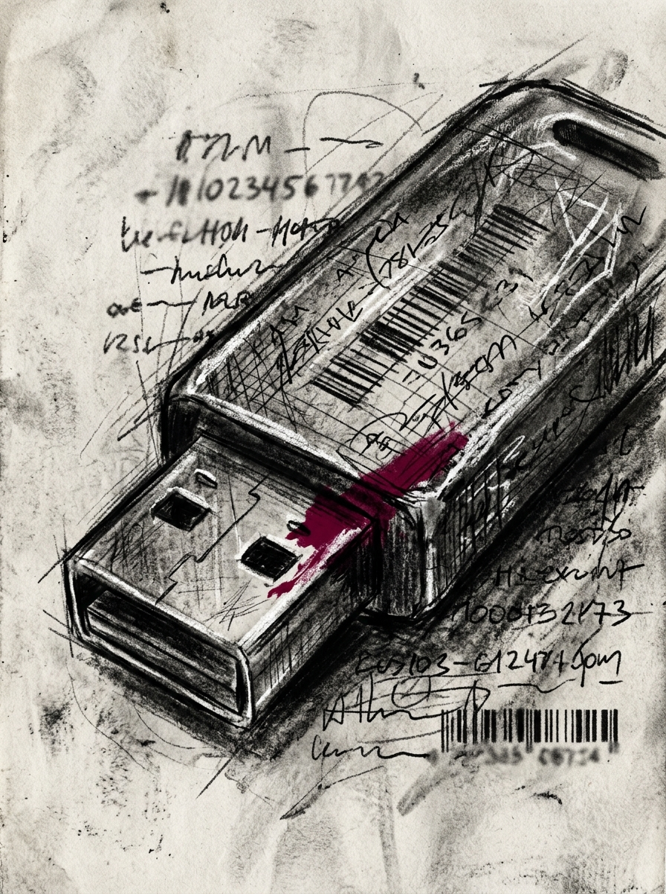

# Zero Sum RPG Scenario: The Genetic Copyright

## Real-World Inspiration
Dit Scenario is zwaar geanonimiseerd, maar conceptueel afgeleid van actuele wereldwijde gebeurtenissen met betrekking tot: **Bedrijven die menselijke DNA-sequenties patenteren**. Het integreert moderne Digital Demagogue Mechanics en Corporate Overreach.

## 1. The Hook
De Players worden ingehuurd om een zwaar beveiligd Bio-Tech hoofdkwartier te infiltreren. Een invloedrijke **Political Streamer** heeft hun parasociale zwerm van miljoenen volgers ingezet als een onwetend schild (weaponized) voor een illegale operatie die binnen plaatsvindt. De autoriteiten zullen niet ingrijpen uit angst voor een enorme PR-ramp en rellen.

## 2. The Digital Demagogue
De primaire Antagonist is geen zwaarbewapende Warlord, maar een Influencer die de aandacht opeist. Ze gebruiken geen geweren; ze gebruiken Live-Streams. Als de Players worden ontdekt, zal de Influencer hun gezichten onmiddellijk uitzenden, waardoor de Social Heat direct naar het maximum stijgt en ze wereldwijd worden gedoxxt.

## 3. The Complication
Geweld is hier geen optie. *Als alternatief kunnen the Faceless proberen een DC 3 Subterfuge check te doorstaan om een gelokaliseerde bypass-code te smeden, waardoor de confrontatie volledig wordt vermeden.* **De faciliteit wordt beschermd door experimentele biologische verdedigingsmechanismen.**
Als er één enkel schot wordt gelost, is de Dead Man's Zone Rule van toepassing, en de Players staan voor een onmogelijke Extraction tegen een overweldigende overmacht.

## 4. Zero Sum Consistency Matrix (ZSCM)
Om ervoor te zorgen dat het Scenario de meedogenloze asymmetrie van het *Zero Sum* systeem behoudt, zijn de ZSCM-waarden vooraf berekend:

* **Antagonist Power (E):** 5/10
* **Player Starting Resources (R):** 4/10
* **Initial Intel Asymmetry (I):** 6/10
* **Collateral Damage Risk (D):** 7/10
* **Total Stress Score:** 22/30 (Geldig: Mechanically Solvable but Asymmetric)

## 5. Objectives & Extraction
1. **Infiltrate:** Omzeil de fysieke beveiliging zonder de volgerszwerm te alarmeren.
2. **Isolate:** Koppel de Influencer los van het wereldwijde netwerk om de uitzendingsdreiging te stoppen.
3. **Extract:** Stel de Objective Data veilig en verdwijn voordat de algoritmische politie-respons arriveert.
