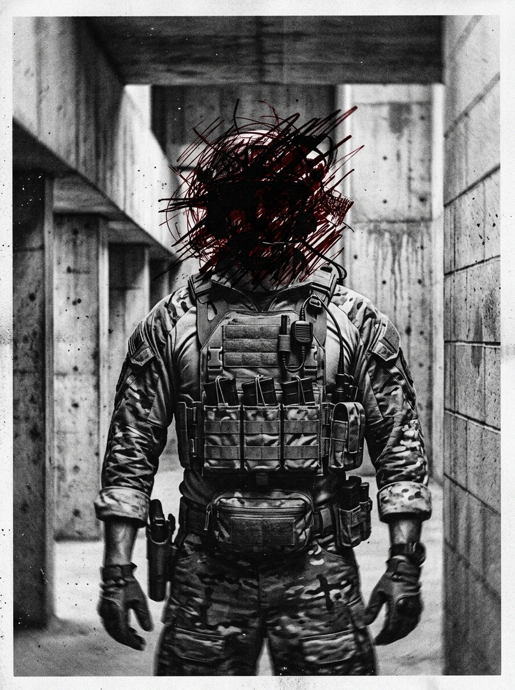

# Zero Sum RPG Scenario: The Reality Filter

## Real-World Inspiration
Dit scenario is zwaar geanonimiseerd maar conceptueel afgeleid van actuele wereldwijde gebeurtenissen met betrekking tot: **AR-lenzen die de realiteit censureren volgens corporate guidelines**. Het integreert moderne Digital Demagogue mechanics en corporate overreach.

## 1. The Hook
De spelers zijn ingehuurd om een zwaar beveiligd AR Broadcasting Center te infiltreren. Een invloedrijke **Viral Prankster** heeft zijn parasociale zwerm van miljoenen volgers ingezet als een onbewust menselijk schild voor een illegale operatie die zich binnen afspeelt. De autoriteiten zullen niet ingrijpen uit angst voor een massale PR-ramp en rellen.

## 2. The Digital Demagogue
De primaire antagonist is geen zwaarbewapende warlord, maar een influencer die de aandacht trekt. Ze gebruiken geen geweren; ze gebruiken live-streams. Als de spelers worden gedetecteerd, zal de influencer onmiddellijk hun gezichten broadcasten, waardoor de Social Heat meteen naar het maximum stijgt en ze wereldwijd gedoxxt worden.

## 3. The Complication
Geweld is hier geen optie. *Als alternatief kan de Faceless een DC 3 Subterfuge check proberen om een gelokaliseerde bypass code te smeden, waardoor de confrontatie volledig wordt vermeden.* **Spelers moeten navigeren in een omgeving waar ze niet kunnen vertrouwen op wat ze zien.**
Als er ook maar één schot wordt gelost, is de Dead Man's Zone rule van toepassing en staan de spelers voor een onmogelijke extraction tegen een overweldigende overmacht.

## 4. Zero Sum Consistency Matrix (ZSCM)
Om ervoor te zorgen dat het scenario de meedogenloze asymmetrie van het *Zero Sum* systeem behoudt, zijn de ZSCM waarden vooraf berekend:

* **Antagonist Power (E):** 5/10
* **Player Starting Resources (R):** 5/10
* **Initial Intel Asymmetry (I):** 5/10
* **Collateral Damage Risk (D):** 4/10
* **Total Stress Score:** 19/30 (Valid: Mechanisch op te lossen maar asymmetrisch)

## 5. Objectives & Extraction
1. **Infiltrate:** Omzeil de fysieke security zonder de volgerszwerm te alarmeren.
2. **Isolate:** Koppel de influencer los van het globale network om de broadcast dreiging te stoppen.
3. **Extract:** Stel de objective data veilig en verdwijn voordat de algoritmische police response arriveert.
