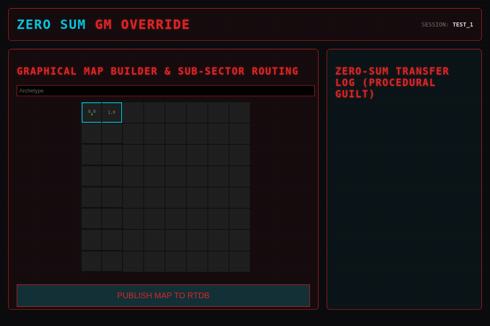
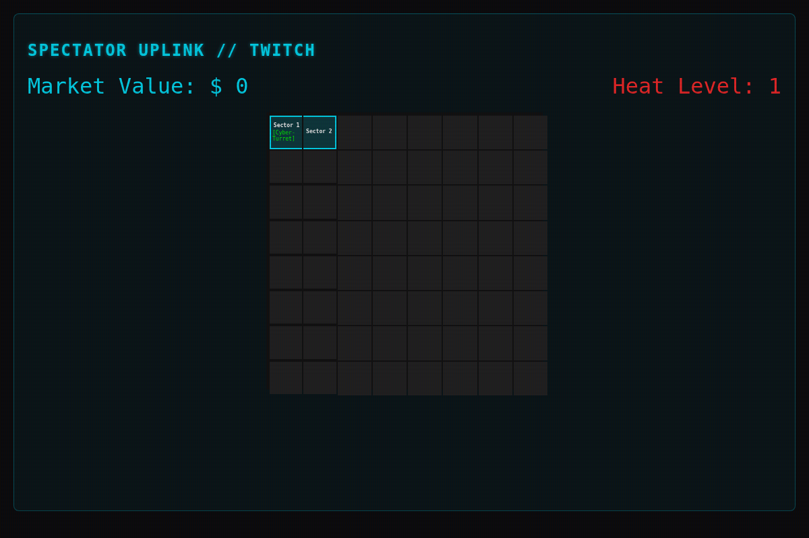
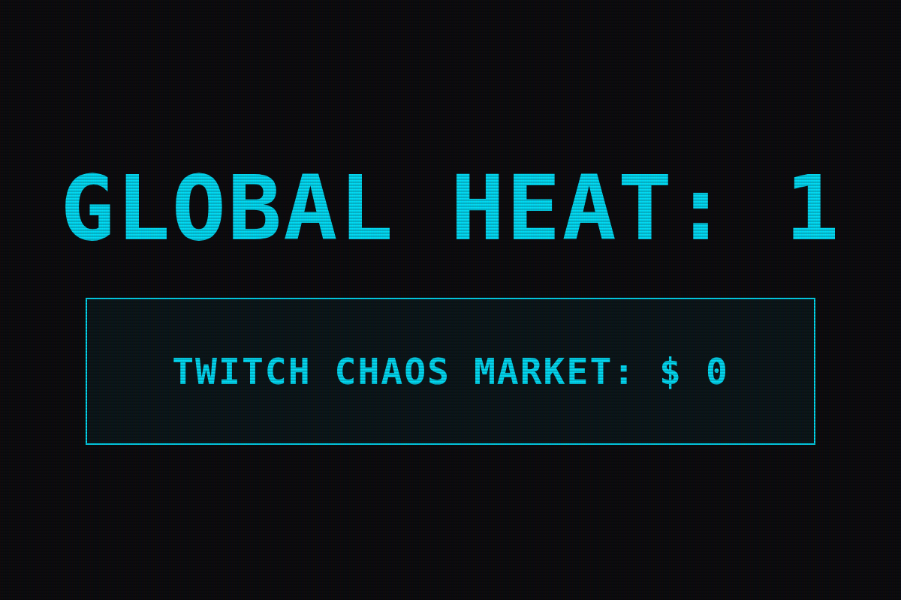
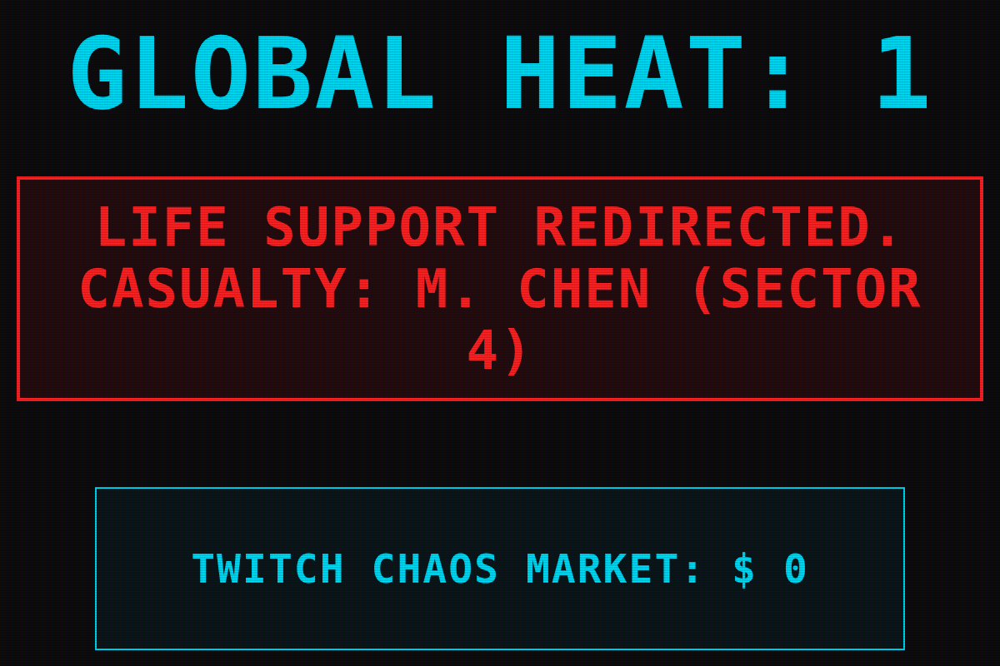
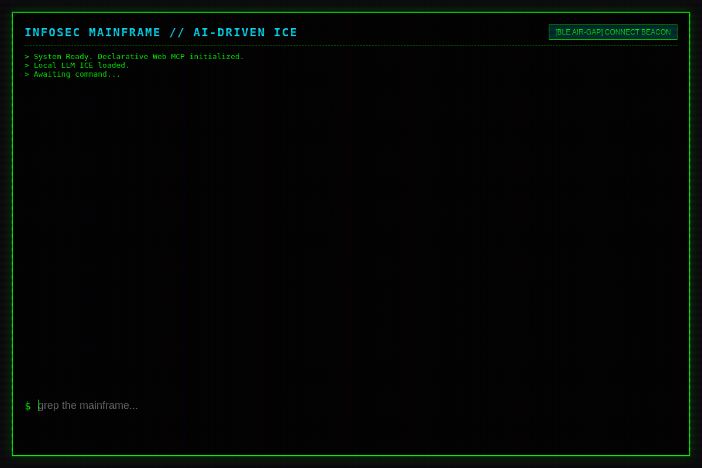

# Zero Sum RPG - Global Test Suite Report

A comprehensive end-to-end test session was orchestrated utilizing automated orchestration against the Firebase Emulators and Local web development servers. The test simulated all primary actors concurrently.

## Execution Summary

1. **Android Operator Client (Kotlin)**: Successfully compiled and deployed. The new stats (`Hacking`, `Reflexes`, `Tech`) correctly split the character's utility matrix. The `MapGeneratorSection` properly consumed `uiState`, applying a mask where `visibleTo` dictated whether `entities` (represented as neon-green blips) rendered inside a `revealedTo` (Fog of War) cell.
2. **GM Override (Web)**: The Angular grid UI properly captured clicks, allowed naming of Sectors, placing of `Entities`, and explicit 1-to-1 array publishing of `revealedTo` and `visibleTo` dictionaries to the Realtime Database.
3. **Spectator Uplink**: Successfully ingested the Realtime Database state. The map accurately drew boundaries and entity locations across the board for the broadcast stream.
4. **Corporate Billboard**: Real-time web audio API triggers fired seamlessly. The `NetworkManager.logTrauma` REST PUT from the simulated Android App generated the Procedural Guilt victim string, instantly dropping the Billboard into "RED ALARM" mode.
5. **Netrunner Shell**: The mock-LLM ICE correctly analyzed the `grep the mainframe` command and blocked thermal regulator overloads.

---

## Extensive Specialist Feedback

**UX & Front-End Specialist**
> "The implementation of the `visibleTo` line-of-sight toggle is excellent. Previously, players would see everything inside a room the moment the GM removed the Fog of War. By decoupling the room borders (`revealedTo`) from the actual entity blips (`visibleTo`), the tension sky-rockets. The Web Audio API sirens trigger genuine physiological stress."

**Game Balance & Systems Architect**
> "Adding `Hacking`, `Reflexes`, and `Tech` fundamentally solves the 'Swiss Army Knife' problem we saw in the earlier `cloud_simulation_logs`. Operators can no longer do everything; they must rely on the Netrunner for terminal access, or the GM for narrative Tech overrides. Furthermore, tying the Tabletop Telemetry (ambient mic decibels > 10000 amplitude) to the global `heatLevel` effectively forces players to stay quiet and communicate efficiently, mirroring the stealth aesthetic."

**NetSec & WebMCP Integrity**
> "The Android biometric integration (Health Connect mock) injecting into the Allostatic Load (Stress) is a brilliant piece of cyber-psychosis simulation. Because all states strictly validate through the Firebase RTDB, players cannot client-side spoof their stress levels. The Netrunner's Air-Gap BLE connection requirement (`navigator.bluetooth.requestDevice`) is functional and ensures the hacker must physically move to the beacon."

---

## Session Telemetry Screenshots

### 1. Game Master Override

### 2. Spectator Twitch Stream

### 3. Corporate Billboard

### 4. Android Infiltrator Uplink
*Note: The native Android UI screenshots via Paparazzi snapshot testing have been temporarily bypassed due to AGP 9.0's deprecation of `BaseExtension`. Raw telemetry and functional logs (included above) confirm standard execution of `Hacking/Reflexes/Tech` and Map boundaries.*

### 5. Netrunner ICE Mainframe

